# Integration of GitHub with Jenkins

### Instructions

* One of the developer in a team will create *new branch* to add `Jenkinsfile`. 
* The developer shall create a pull request and add other developer/s as reviewers. 
* Other developer will review the pull request as well approve and merge to master.
* Each developer will create seperate branch to write atleast one test case for the feature they worked on in Lab Test - 4.
* Each developer shall create a pull request and add other developer/s as reviewers. 
* Other developer will review the pull request as well approve and merge to master.
* Start jenkins server and follow from **step 4** onwards using [Install jenkins](../../overview-of-devops/lab/install-jenkins.md).

### One of the developer can follow below steps to integrate jenkins with GitHub

* Goto Jenkins UI and **Open Blue Oceans**

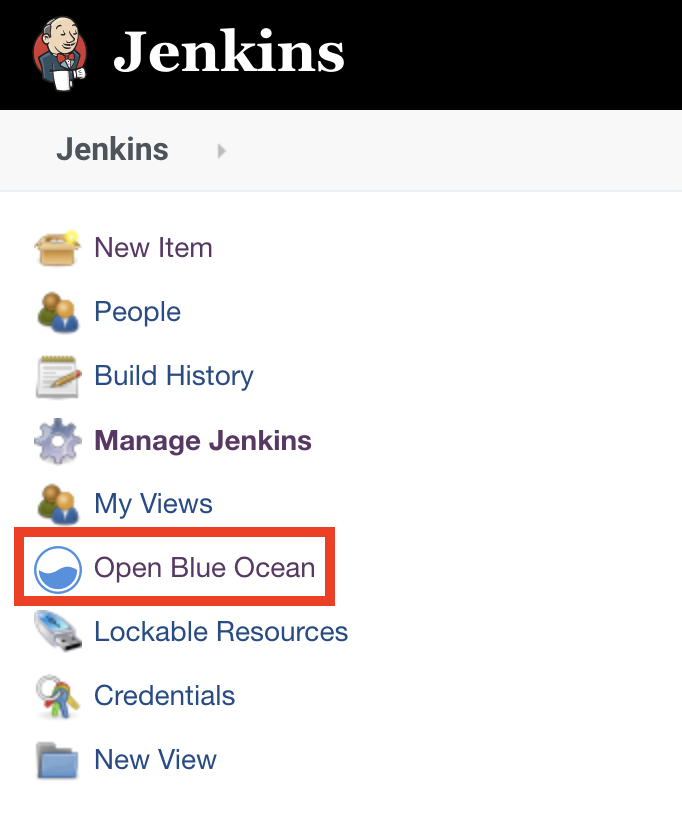

* Let us create a new pipeline

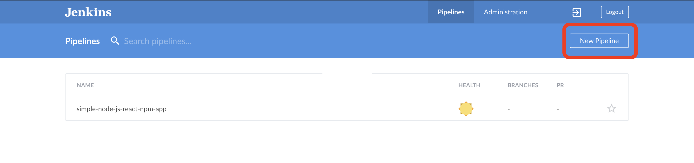

* Select the remote version control system from available options

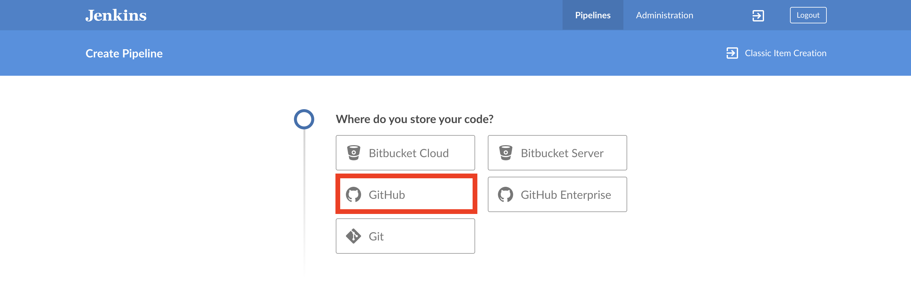

* Connect Jenkins to the remote VCS via *personal access token*

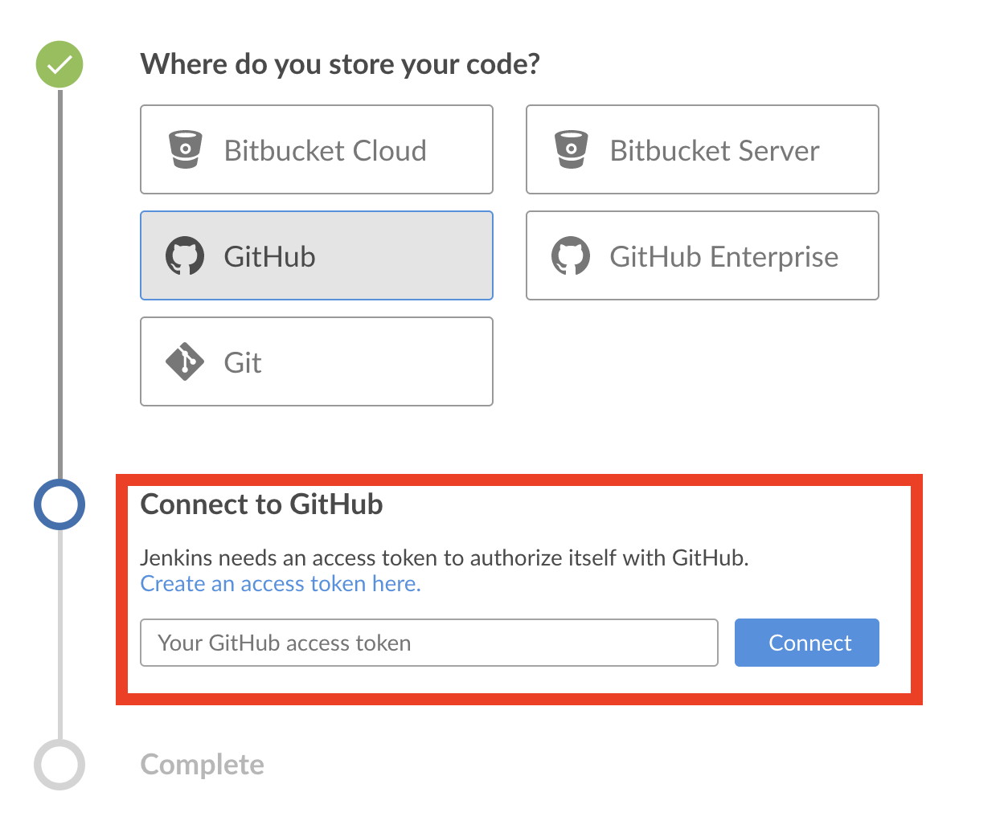

* Owner of the repository can go to [https://github.com/settings/profile](https://github.com/settings/profile)

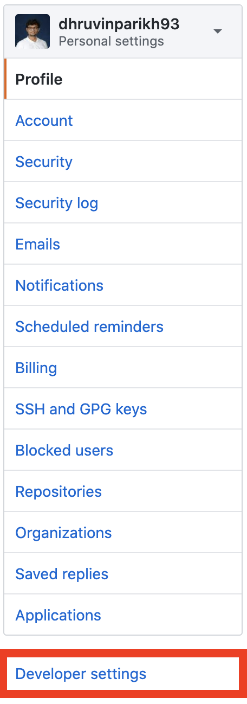

* Click on personal access token

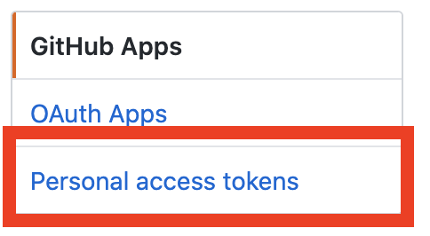

* Click **Generate new token**

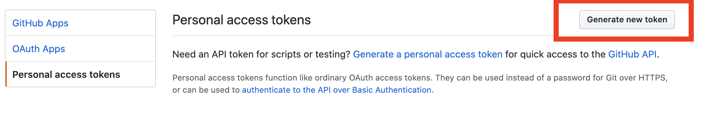

* Make the scope selection as shown.

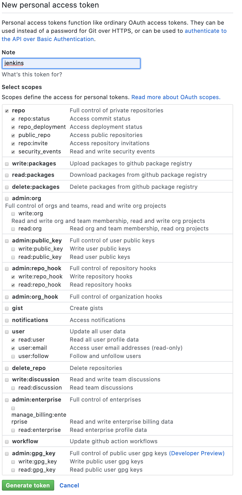

* Copy personal access token 

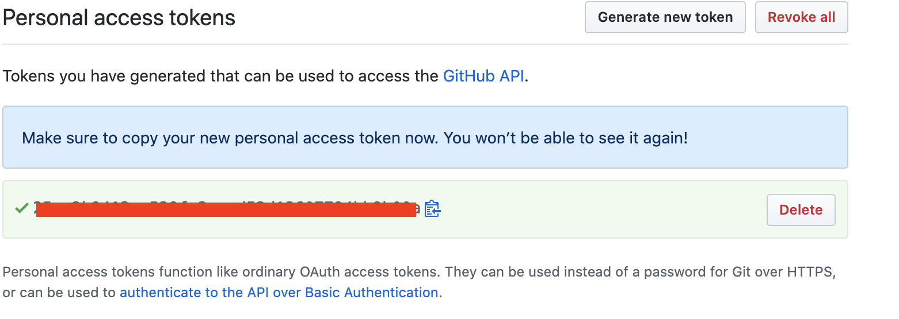

* Paste the personal access from clipboard

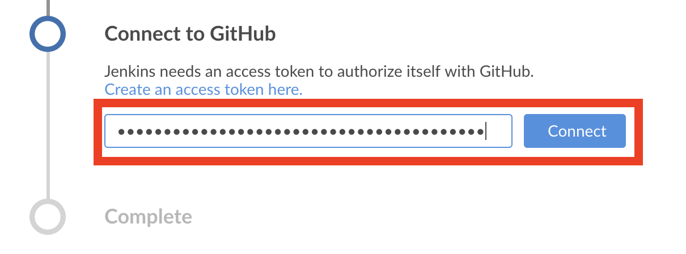

* Select your **username / organisation**.

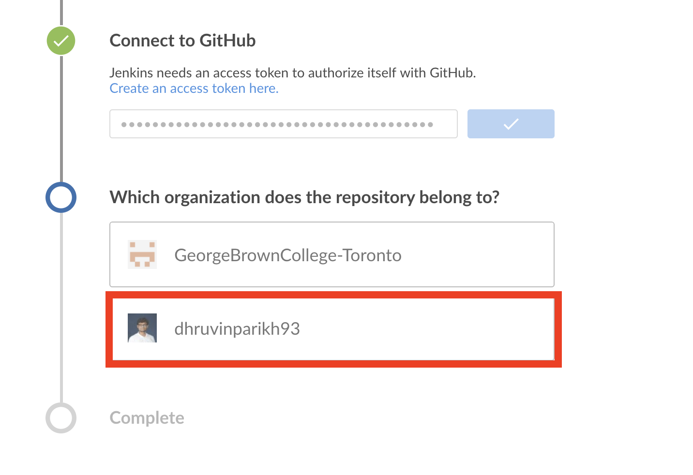

* Click on create pipeline.

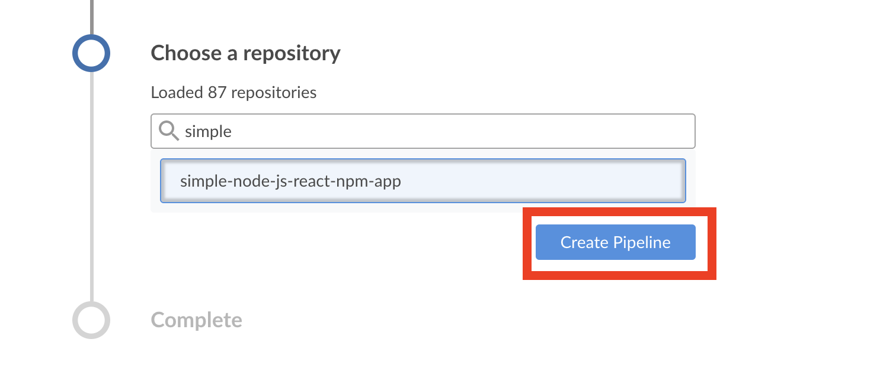

This is the sample of the screenshot after build is triggered via GitHub repository

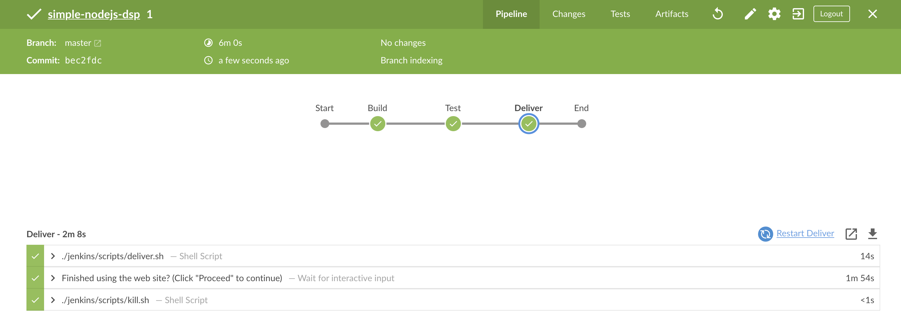

Make the submission on BlackBoard.