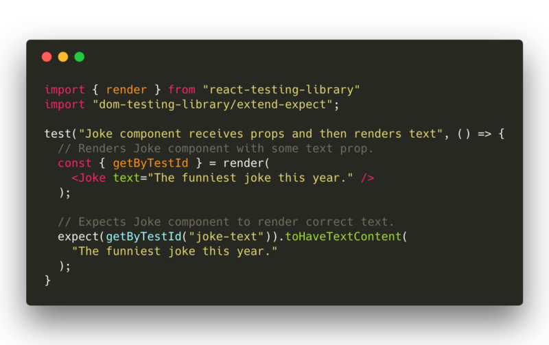
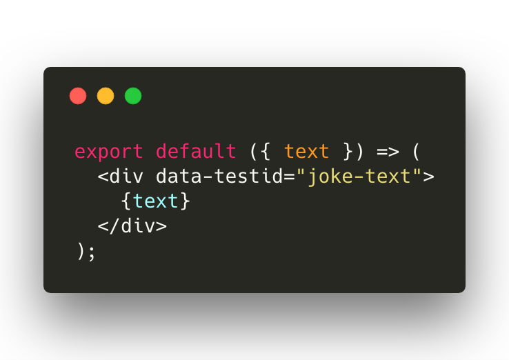
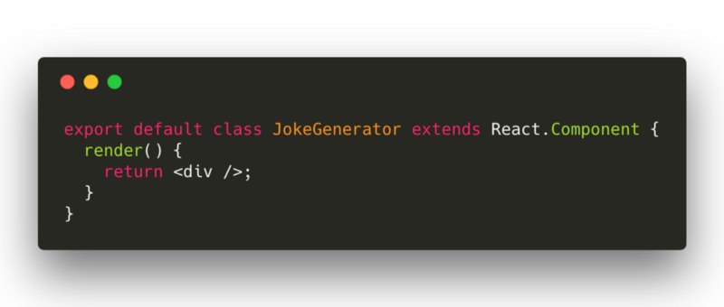
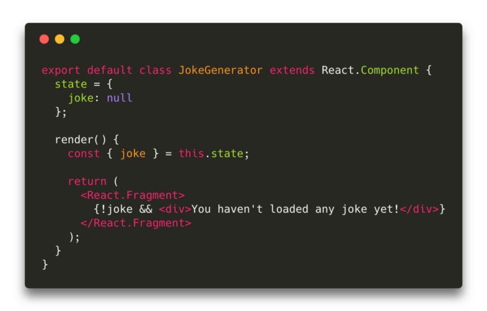
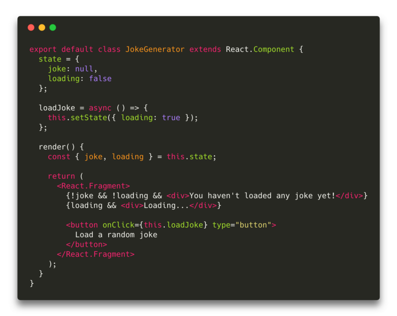
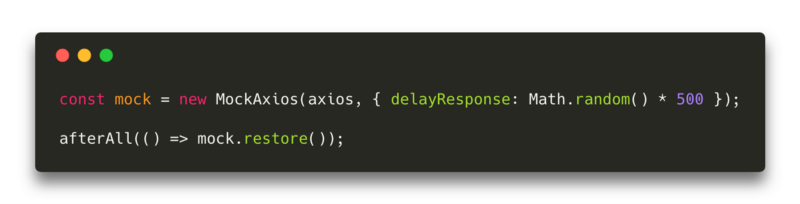
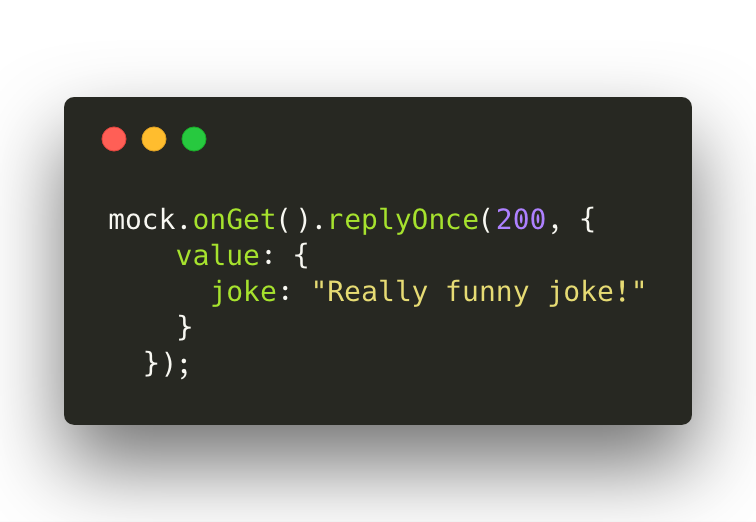
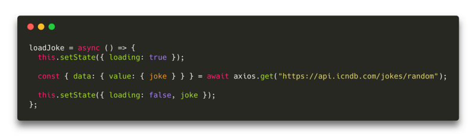
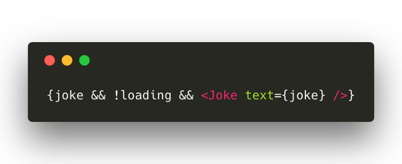
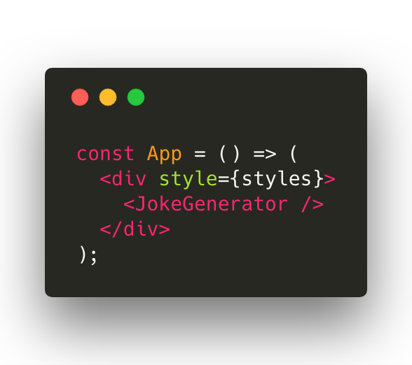

# TDD in react

## Getting started

* Fork the repository [here](https://github.com/GeorgeBrownCollege-Toronto/tdd-in-react-starter.git)
* Clone the repository locally
* run `cd ./tdd-in-react-starter`
* Install following dependencies
    * run `npm install`
    * where in it installs
        * [axios](https://github.com/axios/axios) — used for fetching data from the external API
        * [axios-mock-adapter](https://github.com/ctimmerm/axios-mock-adapter) — used for mocking server responses
        *  [react-testing-library](https://github.com/kentcdodds/react-testing-library) — light, easy to use testing library for rendering, simulating actions, and handling async methods — created by [Kent C. Dodds](https://www.freecodecamp.org/news/quick-guide-to-tdd-in-react-81888be67c64/undefined)
        * [jest](https://facebook.github.io/jest/) — for running the tests and creating assertions

#### Folder structure

* `src/index.js` — entry point for our React app
* `src/jokeGenerator.js` — our container component which fetches, controls, and provides data
`src/joke.js` — simple presentation component
* `src/__tests__/jokeGenerator.test.js` — contains our tests

#### First test

* Each time before we create a component we will write a failing test first and then try to make it pass. Let’s start by writing a test for our dummy component `<Joke />` which will render a text from props.


`jokegenerator.test.js`

Reading from the top: we use a render method from the react-testing-library and pass the &lt;Joke/> component (which does not exist at this point) into it. It returns an object containing a few very useful methods (find the full list of available methods here) — for example getByTestId. It then returns an HTML element based on data-testid as an argument.

Next, we write an expect using above method and data-testid, and check if the element contains the text from props. After running `npm run test`, we get:

```javascript
Joke is not defined
```

Yep, we want it to fail! `<Joke />` does not exist yet, remember? We have only created an empty joke.js file so far. We wrote a test in which we can clearly see what we expect the component to do. Now our job is to make the test pass without modifying the test code. Let’s do that then:


`joke.js`

Now, if you did everything just like I did, the test should pass :)

#### Second Component

Our second component will be responsible for fetching a random joke after a user clicks a button. We’ll save it in the component’s state and pass it down to our `<Joke />` component. We would also like to display a default message when no joke has been loaded yet.

Of course, we start with test first. It is a bigger component, so we’ll be writing the test step-by-step. We’ll also make sure it is passing as often as possible.


`jokeGenerator.test.js`

We are already familiar with the render method, but this time we are taking getByText from the return object. As you might have guessed, the method returns an HTML Element if one exists in the DOM

Run `npm run test`

```javascript
JokeGenerator is not defined
```

You know what to do with it:


`jokeGenerator.js`

run `npm run test` and the test is still failing, but this time it outputs a different error:

```javascript
Unable to find an element with the text.
```

**You haven’t loaded any jokes yet**. This could be because the text is broken up by multiple elements. In this case, you can provide a function for your text matcher to make your matcher more flexible.

Let’s quickly fix that by introducing a state to our component and displaying a default message when there is no joke in the state.


`jokeGenerator.js`

Tests are passing now, so we can move on to add new functionality. Imagine that when we click on a button, the default text in the component disappears to make room for a “Loading…” message. Sounds pretty straightforward, right? We can test this scenario with only three lines of code!

Let’s import the Simulate method first, as we’re going to need that:

```javascript
import { render, Simulate } from “react-testing-library”
```


Append it to our second test — `jokeGenerator.test.js`

The difference between queryByText and getByText is in what each one returns when the element is not found. The first one returns null and the second one throws an error message. Re-running the tests:

```javascript
Unable to find an element with the text: Load a random joke…
```

We need to create a button and set the `onClick` method which will set the loading state to true.


`jokeGenerator.js`

Just like that the test is passing again. Now it’s time to fetch our random joke! Well… it won’t be random in our tests. We’ll mock it using MockAxios.

```javascript
import * as axios from "axios"
import MockAxios from “axios-mock-adapter”
```

Above our tests in `jokeGenerator.test.js`, insert these two lines of code:


Insert above all tests — `jokeGenerator.test.js`

The first line creates a new instance of **MockAxios** with a random delay. The second line takes and executes a callback function after running all the tests in this file, and removes the mocked state from axios.

At the top of our second test where we test the `<JokeGenerator />` component, add:


Top of the second test — `jokeGenerator.test.js`

It mocks the response of any **GET** call done via **axios**. At the end of the same test:


`jokeGenerator.test.js`

Don’t forget to import wait:

```javascript
import { render, Simulate, wait } from “react-testing-library”
```

The wait method waits (4500ms by default) until a callback function stops throwing an error. It is checked at 50ms intervals. Basically we’re just waiting until the loading message disappears from the DOM.

wait is also available as a separate npm package (react-testing-library uses it as a dependency). It was created by Łukasz Gozda Gandecki.

After making all of the code modifications and running the tests, we should get the following fail message:

```html
Expected the element not to be present
Received : <div>Loading…</div>
```

What do you think it might be? According to our test, we expect the loading message to be gone. Additionally, we want to fetch our joke from the API and save it to the state so that next expect passes.


`jokeGenerator.js`


Insert into `render()` method — `jokeGenerator.js`

Tests should pass again now. We are sure that everything works as expected…aren’t we? Notice that we have **never opened our browser and verified manually if our app even works***…However, thanks to how we were writing our tests (so that our tests resemble the way the user would use the application), we can be almost 100% sure that our small app is simply working.

As the last piece of code, let’s add this to the index.js and open the browser :)


`index.js`

## Submission

* Push the code to github
* Submit the github repository link on [Blackboard](https://bb-gbc.blackboard.com/webapps/assignment/uploadAssignment?content_id=_5078199_1&course_id=_184318_1&group_id=&mode=cpview)

### Bonus tip

Because of the way we wrote our tests, we can utilize them as **e2e** tests without adding a single line of code! All we need to do is to remove all the lines related to **MockAxios** and run the tests again! They will now use a real external API. Cool, isn’t it? :)

##### Credits
* [TDD in React](https://www.freecodecamp.org/news/quick-guide-to-tdd-in-react-81888be67c64/)